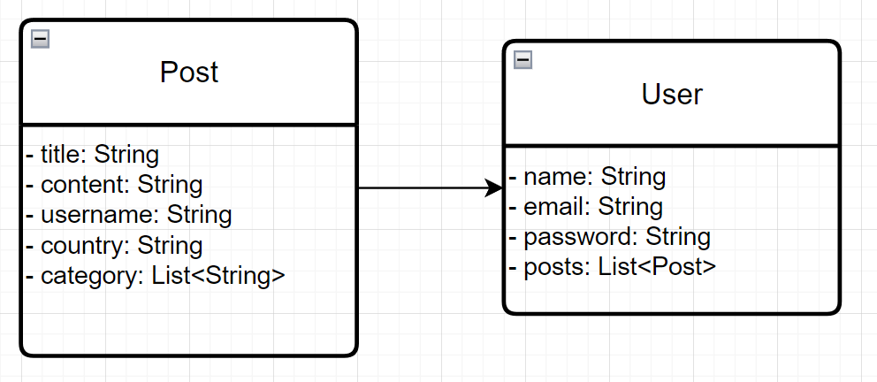
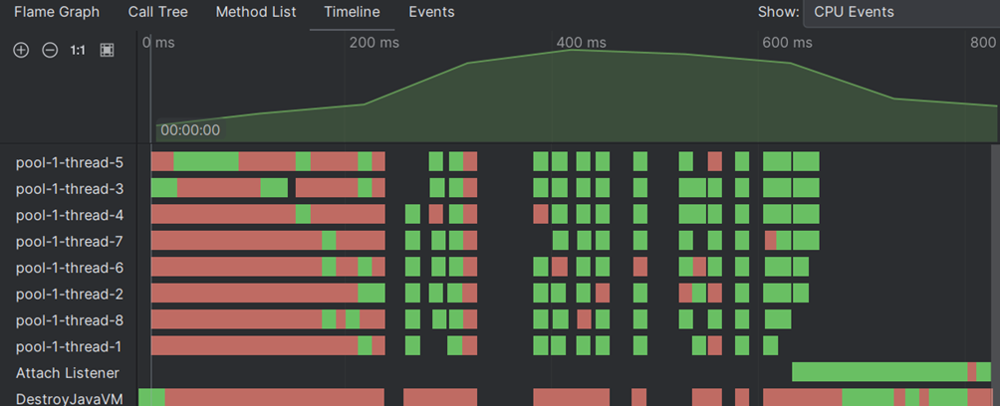

Предметна область - блог подорожей.

Для роботи програми передати два аргументи:
1) шлях до папки: src/main/resources/json-data-files
2) атрибут: category, username або country

Запуск з Maven:
1) mvn clean package 
2) mvn exec:java "-Dexec.args=src/main/resources/json-data-files category"\

Сутності: 
1. Post 
   Атрибути: title, content, username, country, category

2. User
    Атрибути: name, email, password, posts

    
    

Приклад вхідного файлу .json:
```json[
   {
      "title": "Jungle Trek in Borneo",
      "content": "Orangutans, riverboats, and dense rainforest trails.",
      "username": "eco_emma",
      "country": "Malaysia",
      "category": ["wildlife", "adventure"]
   },
   {
      "title": "Vienna’s Classical Charm",
      "content": "Opera houses, palaces, and coffee culture.",
      "username": "city_sam",
      "country": "Austria",
      "category": ["culture", "music", "city"]
   },
   {
      "title": "Exploring the Amazon River",
      "content": "Piranhas, pink dolphins, and jungle lodges.",
      "username": "eco_emma",
      "country": "Brazil",
      "category": ["nature", "adventure"]
   }
]
```

Приклад вихідного файлу .xml сформованої статистики за атрибутом country

```<?xml version="1.0" encoding="UTF-8" standalone="yes"?>
<statistics>
   <item>
      <value>Japan</value>
      <count>739</count>
   </item>
   <item>
      <value>USA</value>
      <count>387</count>
   </item>
   <item>
      <value>Greece</value>
      <count>237</count>
   </item>
</statistics>
```

Під час проведення експериментів з різною кількістю потоків використовувались 8 файлів, в кожному з яких збережено масив з 80_000 json об'єктів.
Обчислення тривалості в коді показало, що незважаючи на те, що на створення більшої кількості потоків ExecutorService витрачає більше часу, 
і спершу близько 200 мс потоки знаходяться у сплячому стані, 
час виконання методу обчислення статистики, який включає парсинг json файлів, 
зменшується зі збільшенням кількості потоків:
- 912 ms - 1 thread
- 858 ms - 2 threads
- 761 ms - 4 threads
- 667 ms - 8 threads

